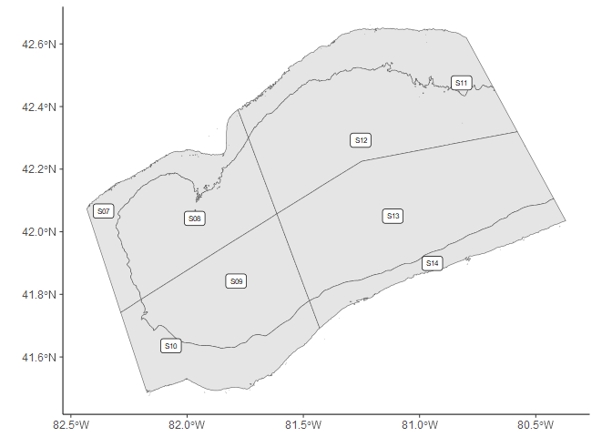
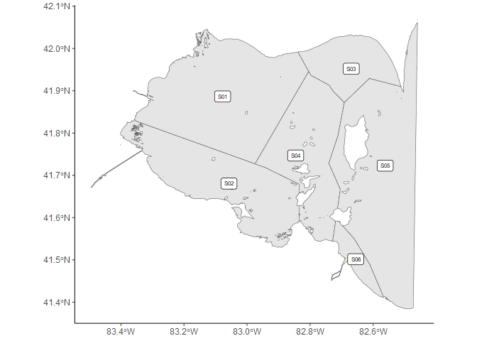
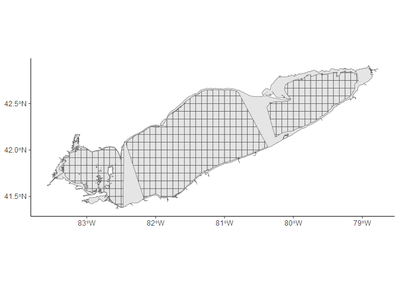

<!-- README.md is generated from README.Rmd. Please edit that file -->

# eriespatial

<!-- badges: start -->


<!-- badges: end -->

The goal of eriespatial is to provide common Lake Erie shapefiles for R
users. Shapefiles have generally been imported as an `sf` object and
also plotted as a base `ggplot2` object. The `sf` objects follow the
naming convention of `shape_[area]`. The `ggplot2` objects follow the
naming convention of `base_[area]`.

## Installation

You can install the development version of `eriespatial` from
[GitHub](https://github.com/) with:

``` r
# install.packages("devtools")
devtools::install_github("LakeErie-PreyFish-Acoustics/eriespatial")
```

## Example

``` r
library(eriespatial)
library(sf)
#> Linking to GEOS 3.9.3, GDAL 3.5.2, PROJ 8.2.1; sf_use_s2() is TRUE
library(ggplot2)
## view the sf shapefile
data("shape_ebstrata")
shape_ebstrata
#> Simple feature collection with 10 features and 4 fields
#> Geometry type: POLYGON
#> Dimension:     XY
#> Bounding box:  xmin: -80.38612 ymin: 42.13901 xmax: -79.05942 ymax: 42.85076
#> Geodetic CRS:  WGS 84
#>    BASIN STRATUM name area_km2                       geometry
#> 1     EB     S15  S15      261 POLYGON ((-80.08151 42.4017...
#> 2     EB     S16  S16      501 POLYGON ((-80.34535 42.3561...
#> 3     EB     S17  S17      649 POLYGON ((-79.70773 42.6330...
#> 4     EB     S18  S18      691 POLYGON ((-79.52855 42.6150...
#> 5     EB     S19  S19      579 POLYGON ((-80.07649 42.4037...
#> 6     EB     S20  S20      548 POLYGON ((-80.08151 42.4017...
#> 7     EB     S21  S21      459 POLYGON ((-79.32086 42.6942...
#> 8     EB     S22  S22      375 POLYGON ((-79.52855 42.6150...
#> 9     EB     S23  S23      229 POLYGON ((-79.06974 42.7886...
#> 10    EB     S24  S24      305 POLYGON ((-79.32086 42.6942...

## view ggplot basemap
data("base_ebstrata")
base_ebstrata
```


### Add custom points to base ggplot

``` r
pointdata <-
  data.frame(LON = c(-79.8,-80,-79.2),
             LAT = c(42.3, 42.4, 42.7))
pointdata <- st_as_sf(pointdata, coords = c("LON", "LAT"), crs = 4269)
base_ebstrata + geom_sf(data = pointdata, color = 'red')
```


### Combining multiple layers

``` r
base_erieshore + geom_sf(data = shape_ebstrata, aes(fill = STRATUM))
```


### Additional Strata

``` r
base_cbstrata
```



``` r
base_wbstrata
```



### 5 minute grid

``` r
base_erieshore + geom_sf(data = shape_5mingrid_surv, alpha = 0.1)
```


