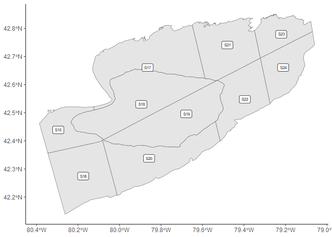

<!-- README.md is generated from README.Rmd. Please edit that file -->

# eriespatial

<!-- badges: start -->
<!-- badges: end -->

The goal of eriespatial is to …

## Installation

You can install the development version of eriespatial from
[GitHub](https://github.com/) with:

``` r
# install.packages("devtools")
devtools::install_github("LakeErie-PreyFish-Acoustics/eriespatial")
```

## Example

This is a basic example which shows you how to solve a common problem:

``` r
library(eriespatial)
## basic example code
data("ebstrata")
ebstrata
```


